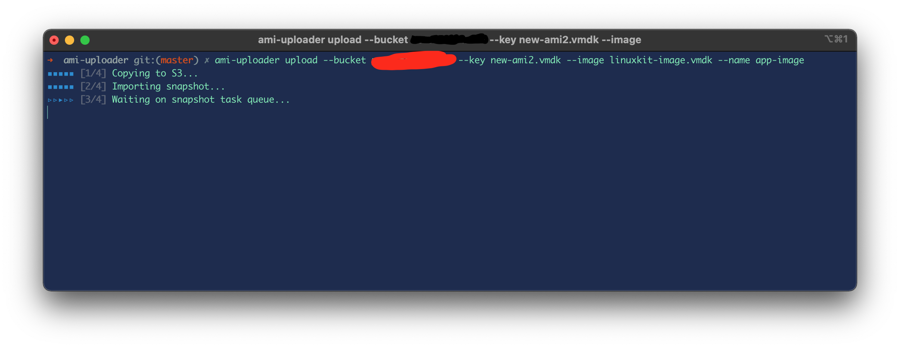

# AMI Uploader
> Created this to use with LinuxKit.

Amazon machine image uploader & other miscellaneous utilities.



Example
```shell
$ cargo run -- upload --bucket my-s3-bucket --image ./my-source-image.vmdk --name my-aws-ami
```

Alternatively
```
$ cargo run -- upload --bucket my-s3-bucket --key new-ami.vmdk --image ./my-source-image.vmdk --name my-aws-ami
```